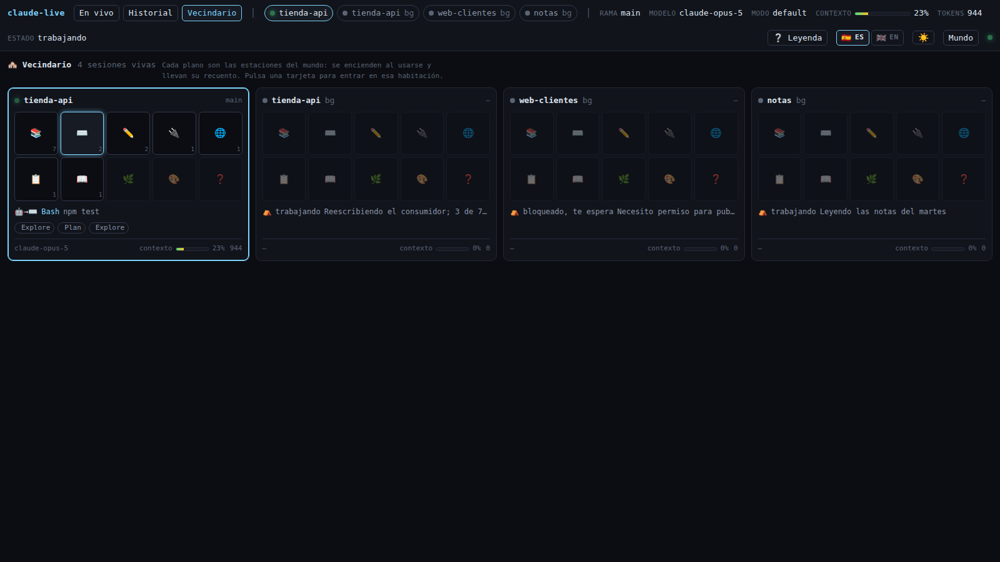
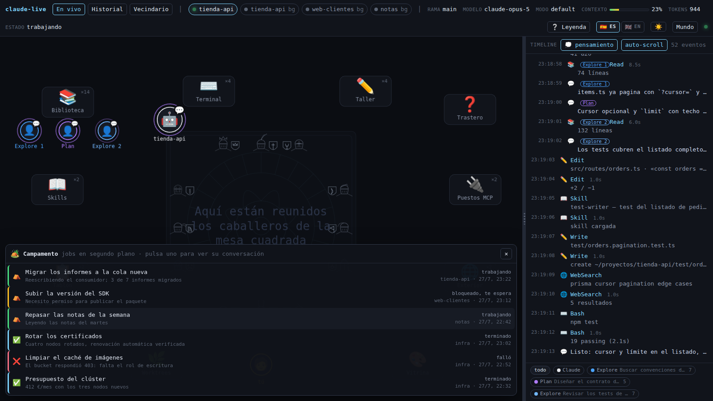
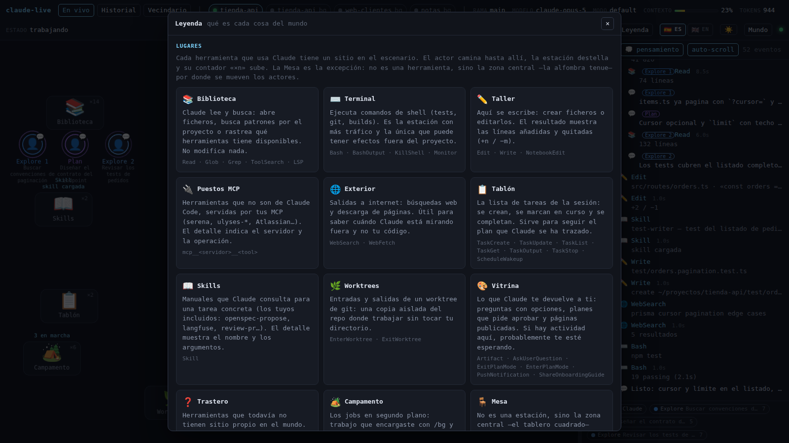
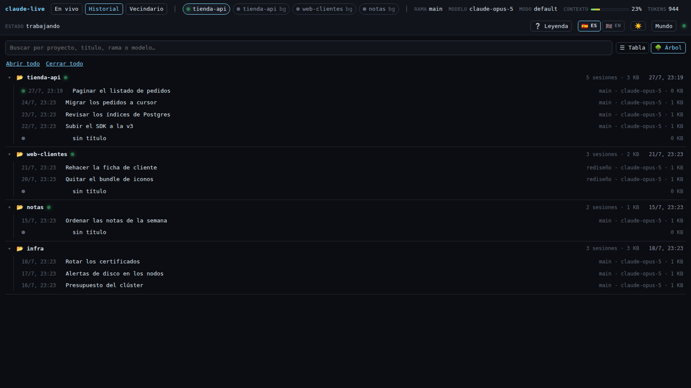
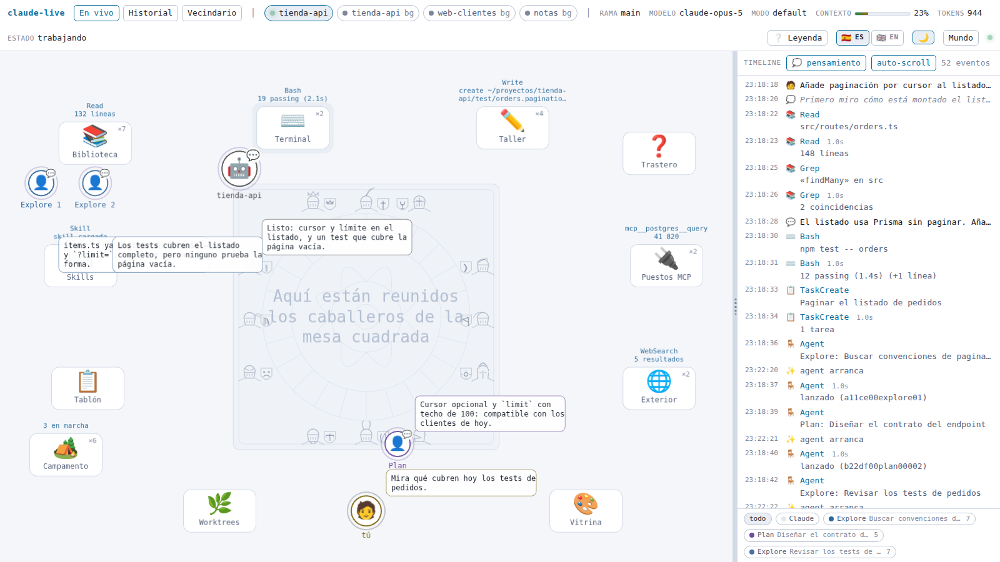

# claude-live

🇬🇧 English · [🇪🇸 Castellano](README.md)

A living world that shows, in real time, what Claude Code is doing under the hood.

You are an avatar that asks for things. Claude is another one that thinks, walks and works.
Subagents are born when they are launched, head off to the Library or the Terminal, and hand
in their report before disappearing. Skills, MCP servers, files and the shell are places on
the stage. Next to it, a timeline with the exact detail of every event.

Nothing has to be started inside the directory you want to watch, and Claude does not have to
be launched in any special way: **any Claude Code session you open shows up on its own**.


*An invented session, start to finish: Claude reads the listing, launches three subagents —two
`Explore` and one `Plan`, in different shades of blue and with their task written underneath—
and each walks off to the station it needs while the timeline fills up. Everything you see
comes from the files Claude Code writes under `~/.claude`.*

## What it shows

- **Live sessions**, with their directory, git branch, model, permission mode, accumulated
  tokens, percentage of context used, and whether Claude is working or waiting for you.
  Each one is a room and you switch between them from the header.
- **Neighbourhood**: every live session at once, each with a plan of its stations —they light up
  when used and carry their count—, what it is doing, its subagents and its context. The station
  is highlighted only while the session is actually working; if it is waiting for you, it is put
  in the past ("last thing"), because waiting is not being anywhere. Click a card and you enter that room. They are deliberately not
  miniature worlds: one canvas per card would be several WebGL renderers at once, and the big
  scene is demanding enough. A background session also shows its job's last report.

  
- **The reasoning**: thinking blocks show up in the avatar's speech bubble.
- **Subagents**: born next to whoever launched them, with their type (`Explore`, `Plan`,
  `general-purpose`, your own) and the description they were launched with. They nest by depth
  and hand in their report when they finish.
- **Background jobs**: the Camp, in the bottom corner. Its sign says how many there are and how
  many are still running, and **clicking it unfolds a banner** with all of them: name, state
  —green working, amber blocked waiting on you, ✅ done, ❌ failed—, project, when it was last
  heard from and the last thing it said about itself. Clicking one opens its conversation. A job
  that claims to be working with no process behind it shows up as 💤 stale, because saying it
  works would be a lie. The Camp belongs to no session: it stays there even if you switch
  rooms.

  

- **Every tool in its place**: read/search, edit/write, shell, MCP, web, tasks, skills,
  worktrees, and whatever comes back to you (questions, plans, artifacts).
- **A synchronised timeline**: filterable by actor, with durations, errors and an inspector
  that shows the full payload of any event.
- **History player**: open a past conversation and play it back like a film, with
  `⏮ ⏪ ⏵ ⏩ ⏭`, speeds from 0.5× to 16× and a slider to jump anywhere. Long conversations are
  fetched in chunks as it goes, so they play in full, and the counter shows the real total from
  the very start.
  With **keyboard shortcuts**: space (or `K`) plays and pauses, `←` `→` move one event, `⇧←`
  `⇧→` ten, `Home` and `End` jump to the ends, and `↑` `↓` change the speed. While you are
  typing in a search box the keyboard is left alone.
- **Help where you are**: hover any station or actor and its explanation appears, along with
  what it is doing and its state, without opening anything.
- **State on two channels**: each actor's ring beats while it is busy and its colour says what
  it is up to —blue thinking, green working, purple talking, amber waiting on you—, with a
  badge on top repeating the state as an icon (🧠 🔧 💬 ❗) so it never depends on colour alone.
- **A legend** (the `❔` button) explaining every place, dweller and colour. The tool list of
  each station comes from the mapping table, so it can never go stale.

  

- **History as a table or as a tree** (the `☰ Table` / `🌳 Tree` switch): the tree groups
  sessions by project, collapsible, with how many there are and how much they take; projects
  with a live session come first and searching expands only what matches.

  

- **Plain mode**: turns the stage off and leaves only the timeline, for when you would rather
  read than watch.
- **Castilian and English**, with the 🇪🇸 ES / 🇬🇧 EN switch next to the legend. The choice is
  remembered between visits and everything is translated: the world (station names, the table
  engraving, the knights) and the timeline summaries too, because the server emits the raw
  value ("74 lines" comes from `{ kind: 'lines', n: 74 }`) and the language is decided when it
  is drawn.
- **Light and dark theme**, with one button (☀ / 🌙) next to the languages. The stage changes
  too: a canvas does not inherit CSS variables, so the scene keeps its own palette with the
  equivalent of every tone. State and subagent colours are the same in both themes (green
  working, blue `Explore`), only darkened over a light background. The first time, your
  system preference is honoured.

  

- **Resizable timeline**: drag the splitter between the world and the panel to give it the room
  you need (double-click restores the default). It is remembered, and narrowing the window
  readjusts it so the world is never squeezed out.

## Requirements

- Node.js 20 or newer.
- Claude Code installed and used at least once (`~/.claude` must exist).
- Linux or macOS. On Linux session detection uses `/proc`, which also rules out recycled PIDs;
  on macOS it falls back to a PID check without that guarantee.

## Getting started

```bash
git clone https://github.com/rafathefull/claude-live.git
cd claude-live
npm install
./scripts/claude-live.sh
```

Open http://127.0.0.1:7317 and, in another terminal, run `claude` wherever you like: the
session will show up on its own.

The script builds the front end the first time (and whenever it spots unbuilt changes), checks
that the port is free and runs in the foreground, so **Ctrl+C really does stop it**:

| Command | What it does |
|---|---|
| `./scripts/claude-live.sh` | Runs in the foreground |
| `./scripts/claude-live.sh bg` | Runs in the background, logging to `~/.local/state/claude-live/` |
| `./scripts/claude-live.sh status` | Says whether it is listening, with which pid and how many sessions it sees |
| `./scripts/claude-live.sh stop` | Stops it, even if another terminal started it |
| `./scripts/claude-live.sh restart` | The two above, in order |
| `./scripts/claude-live.sh logs` | Follows the background log |

`stop` kills the whole process group, not just the launcher, so no stray server is left
holding the port. `npm run server` and `npm start` work too (the latter without any checks).

For development, with hot reload of both the front end and the server:

```bash
npm run dev     # server on 7317 + Vite on 5173 (open 5173)
```

Environment variables:

| Variable | Default | What for |
|---|---|---|
| `CLAUDE_LIVE_PORT` | `7317` | Server port |
| `CLAUDE_CONFIG_DIR` | `~/.claude` | Where Claude Code's configuration lives |
| `XDG_DATA_HOME` | `~/.local/share` | Where the history index cache is kept |

If you change `CLAUDE_LIVE_PORT`, keep in mind that `npm run dev` proxies to a hard-coded 7317
in `vite.config.ts`, and that the hook URL points there too.

## How it hooks into your sessions

All of Claude Code's state lives under `~/.claude`, which is global to your user. The first
three layers are **entirely passive**: they only read files, so you can start and kill the
viewer at any moment without affecting any session.

| Source | What it gives |
|---|---|
| `~/.claude/sessions/<pid>.json` | One file per live `claude` process: `sessionId`, `cwd`, `pid`, `status` (`busy`, `idle`, `dead`, or `unknown` if Claude Code has not written it yet), name and version. It appears when Claude starts and disappears when it closes, so it is the signal for avatars to be born and die. The `procStart` field is the `starttime` from `/proc/<pid>/stat`, which is how orphan files from recycled PIDs are detected. |
| `~/.claude/projects/<slug>/<sessionId>.jsonl` | The transcript: one JSON line per event (`thinking`, `text`, `tool_use`, `tool_result`, tokens and cache, model, branch). Read incrementally by keeping a byte offset, the same way Claude Code does with its own jobs. |
| `<sessionId>/subagents/agent-<id>.jsonl` + `.meta.json` | Each subagent's work plus its `agentType`, `description`, `toolUseId` and `spawnDepth`: that is where the parent → child tree comes from. |
| `~/.claude/daemon/roster.json` | Sessions launched in the background. |

## HTTP hooks (optional, strongly recommended)

**Everything works without hooks**, reading files, with under a second of latency. Hooks are
the difference between seeing what Claude *has done* and what it *is doing*, because Claude
Code notifies you over HTTP the moment it happens. What each one adds:

| Event | What the file cannot give you |
|---|---|
| `PreToolUse` | The heads-up **before** running: the avatar sets off the instant Claude decides to use the tool, not once the result is already written. |
| `PostToolUse` | The result as soon as it resolves, without waiting for the transcript flush. |
| `PostToolUseFailure` | A failing tool marked as an error, in red, without waiting for the file. |
| `PermissionRequest` | **That Claude is waiting for you.** It does not exist in the transcript: without this hook the amber `❗` state never shows up. |
| `SubagentStart` | The exact birth of a subagent, with its type. |
| `SubagentStop` | The exact death. Without it, it has to be inferred: a subagent that writes nothing for 25 s is taken as finished, which for a slow agent means declaring it dead and then "reviving" it. |
| `Notification` | Claude Code notices (permissions, idleness, authentication). |
| `Stop` | End of turn, so the avatar goes back to rest without waiting for the roster. |

### How to configure them

In `~/.claude/settings.json` (your *user settings*), every event takes the same handler. This
block goes inside `"hooks"`, alongside whatever you already have — **do not replace them**:

```json
{
  "hooks": {
    "PreToolUse":         [{ "hooks": [{ "type": "http", "url": "http://127.0.0.1:7317/hook", "async": true, "timeout": 2 }] }],
    "PostToolUse":        [{ "hooks": [{ "type": "http", "url": "http://127.0.0.1:7317/hook", "async": true, "timeout": 2 }] }],
    "PostToolUseFailure": [{ "hooks": [{ "type": "http", "url": "http://127.0.0.1:7317/hook", "async": true, "timeout": 2 }] }],
    "SubagentStart":      [{ "hooks": [{ "type": "http", "url": "http://127.0.0.1:7317/hook", "async": true, "timeout": 2 }] }],
    "SubagentStop":       [{ "hooks": [{ "type": "http", "url": "http://127.0.0.1:7317/hook", "async": true, "timeout": 2 }] }],
    "PermissionRequest":  [{ "hooks": [{ "type": "http", "url": "http://127.0.0.1:7317/hook", "async": true, "timeout": 2 }] }],
    "Notification":       [{ "hooks": [{ "type": "http", "url": "http://127.0.0.1:7317/hook", "async": true, "timeout": 2 }] }],
    "Stop":               [{ "hooks": [{ "type": "http", "url": "http://127.0.0.1:7317/hook", "async": true, "timeout": 2 }] }]
  }
}
```

Three things worth knowing:

- **`"async": true` is not optional.** It is what guarantees that, if the viewer is not
  running, Claude Code will not sit waiting for an answer. Kill the server whenever you like.
- **They apply to every session** in every directory, with nothing to configure per project,
  because they are *user settings*.
- **They reload on the fly**: no need to restart a running session.

Make a copy before editing (`cp ~/.claude/settings.json ~/.claude/settings.json.bak`) and check
the file is still valid JSON: if it breaks, Claude Code silently ignores **all** the settings
in that file.

```bash
jq -e '.hooks | keys' ~/.claude/settings.json
```

### Telling whether they arrive

`GET /api/health` counts the hooks received per event:

```bash
curl -s http://127.0.0.1:7317/api/health
{ "ok": true, "sessions": 1, "clients": 2, "hooks": { "PreToolUse": 4, "PostToolUse": 2 } }
```

If the counter stays empty while Claude works: check the JSON with the `jq` above, confirm the
port matches the server's, and try opening `/hooks` in Claude Code to force a config reload.

Every hook carries the `tool_use_id` that will later appear in the transcript, so the call
**shows up only once** even though it arrives twice: the front end matches them by that id (the
server forwards both without deduplicating).

To remove them, delete those entries from `"hooks"` (or restore your copy). The viewer keeps
working, just with a bit more latency and no permission warnings.

## The life of a subagent

It is the most eye-catching part of the world and the one that touches the most pieces, so it
deserves an explanation:

1. **It is born.** Claude uses the `Agent` tool; the result carries the `agentId` and the task
   description. The viewer emits a birth event in *Claude's* queue —not the child's, because
   Claude is the one launching it— and the world draws the parent-to-child line while the new
   avatar appears with its task in a bubble.
2. **It identifies itself.** The `tool_result` gives the `agentId` but not the type. The type
   arrives with its `agent-<id>.meta.json` (`Explore`, `Plan`, `general-purpose`, your own),
   and at that point the actor is completed and takes its colour. With the `SubagentStart`
   hook, the type is known from the first instant.
3. **It works.** It writes to its own transcript, `subagents/agent-<id>.jsonl`, which the
   viewer follows just like the main session's. Its events are indented in the timeline with a
   badge in its colour, and can be isolated by clicking its pill.
4. **It hands in and dies.** When it finishes, a green line goes out to Claude —the report—
   and the avatar fades away. With `SubagentStop` the moment is exact; without hooks it is
   inferred from inactivity, or from the `tool_result` that closes its `toolUseId` in the
   parent session.

Several subagents at once share out the space around the station they work at, and the nesting
depth (`spawnDepth`) places them next to whoever launched them.

## Privacy

Transcripts contain **your code and your prompts**. So:

- the server listens on `127.0.0.1` only; do not expose it on `0.0.0.0` or behind a tunnel,
- there is no telemetry and no outbound calls: nothing leaves your machine,
- conversation content is not copied anywhere; it is read from the files you already have and
  served to your browser.

With one exception worth knowing: **the history index is stored on disk**, at
`~/.local/share/claude-live/index.json` (or `$XDG_DATA_HOME/claude-live/`). It holds no
conversation bodies, but it does hold their metadata: transcript path, working directory, git
branch, model, permission mode and each session's title. It is a cache so tens of megabytes do
not have to be rescanned on every start; it can be deleted at any time and rebuilds itself.

## Architecture

```
server/src
  config.ts     paths under ~/.claude, port, limits and cache
  roster.ts     live sessions (~/.claude/sessions + daemon/roster.json)
  watcher.ts    recursive fs.watch + incremental reads by offset
  lines.ts      line reading: head, tail and traversal without loading the file
  parser.ts     raw JSONL line → normalised world event
  discover.ts   transcript paths and subagent metadata
  sessions.ts   joins roster + transcripts + subagents into one live state
  history.ts    cached history index and paginated reads
  hooks.ts      normalises what arrives via POST /hook
  index.ts      Fastify: SSE, REST API and static files
server/test     parser and pacing regressions, against real transcripts
web/src
  main.ts, App.vue, styles.css
  i18n.ts       reactive language, remembered between visits
  world/        Pixi stage: scenery, actors, merging and the world clock
  components/   HUD, timeline, inspector, history, player and legend
  store.ts      reactive state fed by SSE
  replay.ts     the player engine, independent from the stage
  format.ts     formatting for tokens, durations, context and colours
web/test        store tests without a browser
shared/         types, i18n texts and the tool → place table, shared by server and front end
tools/          demo world and screenshots with Chromium
```

A few decisions that explain the rest:

**The world clock** (`world/director.ts`). Events arrive in bursts, but a scene is only
readable if each action lasts a minimum. There is one queue per actor: the longer it gets, the
faster the actor walks and the less each action is held. Under pressure —three or more actions
queued— consecutive calls to the **same tool** are merged ("Read ×7"); two `Read`s with a
`Grep` in between are not joined, and a result is never merged with its own call. No event is
ever dropped: the timeline shows them all.

**It is cheap to leave open.** This is a panel meant to sit on a screen for hours, not a game:
the stage runs at a 30 fps ceiling, at resolution 1, and **stops completely when the tab goes
into the background**. Rings and lines only rebuild their geometry when they change state; the
beat is animated with opacity and scale, which cost nothing.

**It adapts to the window size.** Stations are placed as fractions of the stage, and actors
remember *which station and seat* they are at rather than which pixel: on resize they move back
in front of their station instead of staying put. Below 1280 px the timeline narrows, below
960 px it moves under the stage, and in narrow windows actors hide their second line so labels
do not overlap (it stays in the tooltip).

**Tolerance to format changes.** The files under `~/.claude` are not a public API. The parser
ignores types it does not know, a corrupt line does not bring the watcher down, and payloads
are trimmed to 8 KB (there are lines over 700 KB in real transcripts). The trimming happens in
the parser, so it affects both the stream and the paginated timeline; the full content is
fetched separately with `/raw/:uuid`.

### API

| Endpoint | Use |
|---|---|
| `GET /api/stream` | SSE with normalised events |
| `GET /api/sessions?active=1` | Live sessions; without `active`, the history too |
| `GET /api/sessions/:id/events?from=&limit=&agents=0` | Paginated timeline. Subagents come interleaved unless `agents=0` is passed; `limit` defaults to 500 and is capped at 2000 per request, and the player chains chunks with `from` |
| `GET /api/retention` | How many sessions survive Claude Code's cleanup and how many are already gone |
| `GET /api/jobs` | Background jobs, running and finished, with their state checked against the processes that actually exist |
| `GET /api/sessions/:id/raw/:uuid` | The raw line of an event, untrimmed (transcript events only: the ones born from a hook are in no file) |
| `POST /hook` | Ingest for Claude Code hooks |
| `GET /api/health` | Sessions detected, clients connected and hooks received |

### The history index

On start, for each `.jsonl`: read only the first line and tail the last ones to pull out `cwd`,
`gitBranch`, `aiTitle` and the first and last timestamps. Cached in
`~/.local/share/claude-live/index.json` keyed by `path + mtime + size`, so tens of megabytes are
not rescanned on every start.

## Tests

The tests use **your own transcripts**, not mocks, because the real risk in this project is a
format change or an unexpected hostile case:

```bash
npm test           # parser + merging + store + units + splitter + shortcuts + jobs + hood
npm run typecheck  # vue-tsc
```

`test:parser` measures performance against the largest transcript you have and checks payloads
come out trimmed. `test:grouping` feeds the real merging rule with whole sessions and verifies
the representation does not eat steps. `test:store` applies server messages to the front end
store without a browser, covering what breaks silently: duplicated events on SSE reconnect and
subagents attributed to the wrong session when two are open. `test:stats` checks that summaries
with units read correctly in both languages, using the results tools actually return.
`test:split` bounds the timeline splitter from both ends: the panel must not eat the stage, and
on a wide screen it must really be able to grow. `test:shortcuts` covers what actually
breaks in shortcuts: the context —space must still belong to the search box while you type, and
Ctrl, Alt and Meta must not be hijacked—.

`test:hood` covers the summary behind the neighbourhood, where the easy mistakes are counting
results as well as calls (every visit would show twice) and taking the plain last event as "what
it is doing", which may be a mode change.
`test:jobs` exercises the `~/.claude/jobs` reader with hostile input and with your own jobs,
and above all the rule that is not in the file: a job claiming to be "working" with no process
behind it is stale.

Where there is no history to read (a brand new machine, continuous integration) you can seed a
synthetic `~/.claude` with the demo script:

```bash
npm run test:seed -- /tmp/claude-live-ci
CLAUDE_CONFIG_DIR=/tmp/claude-live-ci npm test
```

It is a floor, not a substitute: the demo data is friendly and yours is not. That is what runs
in [continuous integration](.github/workflows/ci.yml), which also mounts the world in a real
Chromium and fails if the console says anything —a runtime Pixi API failure is invisible to
`typecheck`—.

### Demo world

Requires the front end built (`npm run build`) and Playwright's Chromium binaries:

```bash
npx playwright install chromium   # once
npm run demo                      # generates this README's screenshots
npm run gif                       # records the header GIF (needs ffmpeg)
```

The GIF is tuned with `--width`, `--fps` and `--colors`: the scene uses very few colours, so
trimming the palette shrinks the file a lot. The one above is 760 px, 8 fps and 64 colours.

It fabricates a fake `~/.claude` in a temporary directory —an invented session about a
`tienda-api` project, with three subagents— and starts a separate server pointed at it via
`CLAUDE_CONFIG_DIR`. It touches neither your configuration nor your transcripts. Useful for
trying the viewer without personal data and for seeing the world in motion without waiting for
Claude to do something.

`npm run screenshot` does the same against the normal server: opens the app in a headless
Chromium, reports console errors and saves screenshots of the three views.

## State and what is missing

Working: live sessions, subagents, a resizable timeline, inspector, history as a table or a
tree with a complete player, a multi-session neighbourhood, background jobs, retention warning, legend, plain mode, light and
dark theme, hook ingest and the bilingual interface.

What has been done, summarised in plain text, lives in [`CHANGELOG.txt`](CHANGELOG.txt).

**A warning about the history**: Claude Code deletes transcripts after `cleanupPeriodDays` days
(30 by default), so what you see is not everything you have done but whatever survived. The
viewer detects this by comparing the transcripts on disk against the prompt log in
`~/.claude/history.jsonl`, and says so in the history tab with your own numbers. To keep more,
add `"cleanupPeriodDays": 365` to `~/.claude/settings.json`.

Pending:

- An aggregate metrics panel per project and per day.
- No cost in money is shown, only tokens and context percentage: that would mean pinning each
  model's pricing by hand.
- Packaging as a desktop app.

## Licence

MIT. See [LICENSE](LICENSE).

---

Not an official Anthropic product. It reads local files generated by Claude Code, whose format
is internal and may change between versions (developed against 2.1.220).
