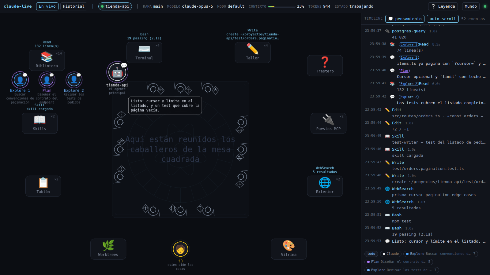

# claude-live

Un mundo vivo para ver, en tiempo real, qué está haciendo Claude Code por debajo.

Tú eres un avatar que pide cosas. Claude es otro que piensa, camina y trabaja. Los
subagentes nacen cuando se lanzan, van a la Biblioteca o a la Terminal, y al terminar le
entregan su informe antes de desaparecer. Las skills, los servidores MCP, los ficheros y la
terminal son lugares del escenario. Al lado, una timeline con el detalle exacto de cada
evento.

No hay que arrancar nada en el directorio que quieras vigilar, ni lanzar Claude de forma
especial: **cualquier sesión de Claude Code que abras aparece sola**.



*Claude acaba de terminar en la Terminal mientras dos subagentes —`Explore` en azul y `Plan`
en morado— trabajan en la Biblioteca. Cada estación lleva la cuenta de las veces que se ha
usado y muestra lo último que pasó por ella.*

## Qué muestra

- **Sesiones vivas**, con su directorio, rama de git, modelo, modo de permisos, tokens
  acumulados, porcentaje de contexto usado y si Claude está trabajando o esperándote.
  Varias sesiones a la vez, cada una en su propia habitación.
- **El razonamiento**: los bloques de pensamiento aparecen en la burbuja del avatar.
- **Subagentes**: nacen junto a quien los lanza, con su tipo (`Explore`, `Plan`,
  `general-purpose`, los tuyos) y la descripción con la que se lanzaron. Se anidan por
  profundidad y entregan su informe al terminar.
- **Cada herramienta en su lugar**: leer/buscar, editar/escribir, shell, MCP, web, tareas,
  skills, worktrees y lo que vuelve hacia ti (preguntas, planes, artifacts).
- **Timeline sincronizada**: filtrable por actor, con duraciones, errores y un inspector que
  muestra el payload completo de cualquier evento.
- **Reproductor del historial**: abre cualquier conversación pasada y reprodúcela como una
  película, con `⏮ ⏪ ⏵ ⏩ ⏭`, velocidades de 0,5× a 16× y barra para saltar a cualquier punto.
- **Leyenda** (botón `❔`) que explica cada lugar, cada habitante y cada color. La lista de
  herramientas de cada estación sale de la tabla de mapeo, así que nunca se queda desfasada.

  

- **Modo sobrio**: apaga la escena y deja solo la timeline, para cuando quieras leer en vez
  de mirar.

## Requisitos

- Node.js 20 o superior.
- Claude Code instalado y usado alguna vez (hace falta `~/.claude`).
- Linux o macOS. En Linux la detección de sesiones usa `/proc`, lo que además descarta PIDs
  reciclados; en macOS se cae a una comprobación de PID sin esa garantía.

## Puesta en marcha

```bash
git clone https://github.com/rafathefull/claude-live.git
cd claude-live
npm install
npm run build
npm start
```

Abre http://127.0.0.1:7317 y, en otra terminal, lanza `claude` donde quieras: la sesión
aparecerá sola.

Para desarrollo, con recarga en caliente del front y del servidor:

```bash
npm run dev     # servidor en 7317 + Vite en 5173 (abre el 5173)
```

Variables de entorno:

| Variable | Por defecto | Para qué |
|---|---|---|
| `CLAUDE_LIVE_PORT` | `7317` | Puerto del servidor |
| `CLAUDE_CONFIG_DIR` | `~/.claude` | Dónde vive la configuración de Claude Code |

## Cómo se engancha a las sesiones

Todo el estado de Claude Code vive bajo `~/.claude`, que es global para tu usuario. Las tres
primeras capas son **puramente pasivas**: solo leen ficheros, así que puedes arrancar y matar
el visor en cualquier momento sin afectar a ninguna sesión.

| Fuente | Qué aporta |
|---|---|
| `~/.claude/sessions/<pid>.json` | Un fichero por proceso `claude` vivo: `sessionId`, `cwd`, `pid`, `status` (`busy`/`idle`), nombre y versión. Aparece al abrir Claude y desaparece al cerrarlo, así que es la señal para hacer nacer y morir avatares. El campo `procStart` es el `starttime` de `/proc/<pid>/stat`, con lo que se detectan ficheros huérfanos por PID reciclado. |
| `~/.claude/projects/<slug>/<sessionId>.jsonl` | El transcript: una línea JSON por evento (`thinking`, `text`, `tool_use`, `tool_result`, tokens y caché, modelo, rama). Se lee de forma incremental guardando el offset en bytes, igual que hace Claude Code con sus propios jobs. |
| `<sessionId>/subagents/agent-<id>.jsonl` + `.meta.json` | El trabajo de cada subagente y su `agentType`, `description`, `toolUseId` y `spawnDepth`: de ahí sale el árbol padre → hijos. |
| `~/.claude/daemon/roster.json` | Sesiones lanzadas en segundo plano. |

### Hooks HTTP (opcional)

Sin hooks todo funciona, con menos de un segundo de latencia. Con ellos la latencia baja a
cero y además se ve cuándo Claude está **esperando un permiso tuyo**. En
`~/.claude/settings.json`, para los eventos `PreToolUse`, `PostToolUse`, `SubagentStart`,
`SubagentStop`, `PermissionRequest`, `Notification` y `Stop`:

```json
{
  "type": "http",
  "url": "http://127.0.0.1:7317/hook",
  "async": true,
  "timeout": 2
}
```

`"async": true` es importante: así, si el visor no está levantado, Claude Code no espera por
él. Como son *user settings*, se aplican a todas tus sesiones en todos los directorios sin
configurar nada por proyecto, y se recargan en caliente: no hay que reiniciar la sesión.

Para comprobar que están llegando, `GET /api/health` cuenta los hooks recibidos por evento:

```json
{ "ok": true, "sessions": 1, "clients": 2, "hooks": { "PreToolUse": 4, "PostToolUse": 2 } }
```

Cada hook trae el `tool_use_id` que después aparecerá en el transcript, así que la llamada
se ve una sola vez aunque llegue por las dos vías.

## Privacidad

Los transcripts contienen **tu código y tus prompts**. Por eso:

- el servidor escucha solo en `127.0.0.1`; no lo expongas en `0.0.0.0` ni detrás de un túnel,
- no hay telemetría ni ninguna llamada saliente,
- nada se copia a otro sitio: se leen los ficheros que ya tienes y se sirven a tu navegador.

## Arquitectura

```
server/src
  roster.ts     sesiones vivas (~/.claude/sessions + daemon/roster.json)
  watcher.ts    fs.watch recursivo + lectura incremental por offset
  parser.ts     línea de JSONL → evento normalizado del mundo
  discover.ts   rutas de transcripts y metadatos de subagentes
  sessions.ts   une roster + transcripts + subagentes en un estado vivo
  history.ts    índice del historial cacheado y lectura paginada
  hooks.ts      normaliza los eventos que llegan por POST /hook
  index.ts      Fastify: SSE, API REST y estáticos
web/src
  world/        escena Pixi: escenario, actores, agrupación y reloj del mundo
  components/   HUD, timeline, inspector, historial, reproductor y leyenda
  store.ts      estado reactivo alimentado por SSE
  replay.ts     motor del reproductor, independiente de la escena
shared/         tipos y tabla herramienta → lugar, compartidos por servidor y front
```

Dos decisiones que explican el resto:

**El reloj del mundo** (`world/director.ts`). Los eventos llegan a ráfagas, pero una escena
solo es legible si cada acción dura un mínimo. Hay una cola por actor: cuanto más larga,
más rápido camina y menos se sostiene cada acción. En atascos, las llamadas repetidas a la
misma estación se agrupan («Read ×7»). Nunca se descarta un evento: la timeline los muestra
todos.

**Tolerancia a los cambios de formato.** Los ficheros de `~/.claude` no son una API pública.
El parser ignora los tipos que no conoce, una línea corrupta no tumba el watcher, y los
payloads se recortan a 8 KB para el stream (hay líneas de más de 700 KB en transcripts
reales; el íntegro se pide aparte).

### API

| Endpoint | Uso |
|---|---|
| `GET /api/stream` | SSE con los eventos normalizados |
| `GET /api/sessions?active=1` | Sesiones vivas; sin `active`, también el historial |
| `GET /api/sessions/:id/events?from=&limit=&agents=1` | Timeline paginada con subagentes |
| `GET /api/sessions/:id/raw/:uuid` | Línea cruda de un evento, sin recortar |
| `POST /hook` | Ingesta de los hooks de Claude Code |
| `GET /api/health` | Sesiones detectadas y clientes conectados |

## Pruebas

Las pruebas usan **tus propios transcripts**, no mocks, porque el riesgo real de este
proyecto es que el formato cambie o que aparezca un caso hostil:

```bash
npm test           # parser + agrupación
npm run typecheck  # vue-tsc
```

`test:parser` mide el rendimiento con el transcript más grande que tengas y comprueba que
los payloads salen recortados. `test:grouping` alimenta la regla de agrupación real con
sesiones enteras y verifica que la representación no se come pasos. `test:store` aplica
mensajes del servidor al store del front sin navegador, para cubrir lo que se rompe en
silencio: eventos duplicados al reconectar el SSE y subagentes atribuidos a la sesión
equivocada cuando hay dos abiertas.

### Mundo de demostración

```bash
npm run demo          # genera las capturas de este README
npm run demo -- --keep   # deja el servidor de demostración vivo para mirarlo
```

Fabrica un `~/.claude` ficticio en un directorio temporal —una sesión inventada sobre un
proyecto `tienda-api`, con dos subagentes— y arranca un servidor aparte apuntando a él con
`CLAUDE_CONFIG_DIR`. No toca tu configuración ni tus transcripts. Sirve para probar el visor
sin datos personales y para ver el mundo en movimiento sin esperar a que Claude haga algo.

`npm run screenshot` hace lo propio contra el servidor normal: abre la app en un Chromium sin
ventana, informa de los errores de consola y guarda las capturas de las tres vistas.

## Estado y qué falta

Funcionando: sesiones vivas, subagentes, timeline, inspector, historial con reproductor,
leyenda, modo sobrio e ingesta de hooks.

Pendiente:

- Avatares para los jobs en segundo plano de `~/.claude/jobs`.
- Panel de métricas agregadas por proyecto y día.
- No se muestra coste en dinero, solo tokens y porcentaje de contexto: habría que fijar las
  tarifas de cada modelo a mano.
- Empaquetado como app de escritorio.

## Licencia

MIT. Ver [LICENSE](LICENSE).

---

No es un producto oficial de Anthropic. Lee ficheros locales generados por Claude Code, cuyo
formato es interno y puede cambiar entre versiones (desarrollado contra la 2.1.220).
