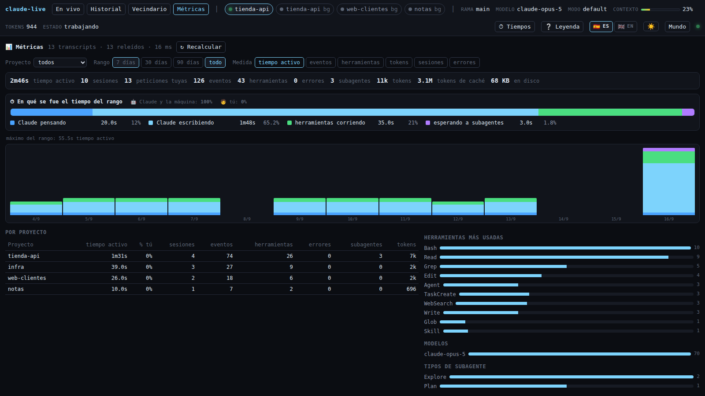

# claude-live

🇪🇸 Castellano · [🇬🇧 English](README.en.md)

Un mundo vivo para ver, en tiempo real, qué está haciendo Claude Code por debajo.

Tú eres un avatar que pide cosas. Claude es otro que piensa, camina y trabaja. Los
subagentes nacen cuando se lanzan, van a la Biblioteca o a la Terminal, y al terminar le
entregan su informe antes de desaparecer. Las skills, los servidores MCP, los ficheros y la
terminal son lugares del escenario. Al lado, una timeline con el detalle exacto de cada
evento.

No hay que arrancar nada en el directorio que quieras vigilar, ni lanzar Claude de forma
especial: **cualquier sesión de Claude Code que abras aparece sola**.


*Una sesión inventada, de principio a fin: Claude lee el listado, lanza tres subagentes —dos
`Explore` y un `Plan`, con matices distintos del azul y su cometido escrito debajo—, y cada uno
se va a la estación que le toca mientras la timeline se llena. Todo lo que se ve sale de los
ficheros que Claude Code escribe en `~/.claude`.*

## Qué muestra

- **Sesiones vivas**, con su directorio, rama de git, modelo, modo de permisos, tokens
  acumulados, porcentaje de contexto usado y si Claude está trabajando o esperándote.
  Cada una es una habitación y se cambia entre ellas desde la cabecera.
- **Vecindario**: todas las sesiones vivas a la vez, cada una con el plano de sus estaciones
  —se encienden al usarse y llevan su recuento—, lo que está haciendo, sus subagentes y su
  contexto. La estación va marcada con halo solo si la sesión está trabajando de verdad; si te
  está esperando, se dice en pasado («lo último»), porque esperar no es estar en ninguna parte. Pulsa una tarjeta y entras en esa habitación. No son mundos en
  miniatura a propósito: un canvas por tarjeta serían varios renderers WebGL a la vez, y la
  escena grande ya da bastante trabajo. Una sesión de background enseña además el parte de su
  job.

  
- **El razonamiento**: los bloques de pensamiento aparecen en la burbuja del avatar.
- **Subagentes**: nacen junto a quien los lanza, con su tipo (`Explore`, `Plan`,
  `general-purpose`, los tuyos) y la descripción con la que se lanzaron. Se anidan por
  profundidad y entregan su informe al terminar.
- **Jobs en segundo plano**: el Campamento, en la esquina de abajo. Su cartel dice cuántos hay y
  cuántos siguen en marcha, y **al pulsarlo despliega un banner** con todos: nombre, estado
  —verde trabajando, ámbar bloqueado esperándote, ✅ hecho, ❌ fallido—, proyecto, cuándo se supo
  de él y lo último que dijo de sí mismo. Pulsando uno se abre su conversación. Un job que se
  declara trabajando pero no tiene proceso detrás sale como 💤 residuo, porque decir que trabaja
  sería mentir. El Campamento no pertenece a ninguna sesión: sigue ahí aunque cambies de
  habitación.

  

- **Cada herramienta en su lugar**: leer/buscar, editar/escribir, shell, MCP, web, tareas,
  skills, worktrees y lo que vuelve hacia ti (preguntas, planes, artifacts).
- **Timeline sincronizada**: filtrable por actor, con duraciones, errores y un inspector que
  muestra el payload completo de cualquier evento.
- **Reproductor del historial**: abre una conversación pasada y reprodúcela como una película,
  con `⏮ ⏪ ⏵ ⏩ ⏭`, velocidades de 0,5× a 16× y barra para saltar a cualquier punto. Las
  conversaciones largas se traen por tramos mientras avanza, así que se reproducen enteras, y el
  contador muestra el total real desde el primer momento.
  Con **atajos de teclado**: espacio (o `K`) reproduce y pausa, `←` `→` avanzan un evento,
  `⇧←` `⇧→` diez, `Inicio` y `Fin` van a los extremos, y `↑` `↓` cambian la velocidad.
  Mientras escribes en un buscador el teclado no se toca.
- **Ayuda en el sitio**: pasa el ratón por cualquier estación o actor y sale su explicación,
  con lo que está haciendo y su estado, sin abrir nada.
- **Estado a dos señales**: el anillo de cada actor late cuando está activo y su color dice en
  qué anda —azul pensando, verde trabajando, morado hablando, ámbar esperándote—, con una
  insignia encima que repite el estado en icono (🧠 🔧 💬 ❗) para no depender solo del color.
- **Leyenda** (botón `❔`) que explica cada lugar, cada habitante y cada color. La lista de
  herramientas de cada estación sale de la tabla de mapeo, así que nunca se queda desfasada.

  

- **Historial como tabla o como árbol** (conmutador `☰ Tabla` / `🌳 Árbol`): el árbol agrupa las
  sesiones por proyecto, plegables, con cuántas hay y cuánto ocupan; los proyectos con sesión
  viva salen primero y buscar despliega solo lo que coincide.

  

- **Métricas** por proyecto y por día: sesiones, peticiones tuyas, eventos, herramientas,
  errores, subagentes, tokens (los de caché aparte) y tamaño en disco, con gráfica de barras y
  los rankings de herramientas, modelos y tipos de subagente. Se puede filtrar por proyecto y
  por rango, y pulsar un proyecto de la tabla lo enfoca.

  

- **Modo sobrio**: apaga la escena y deja solo la timeline, para cuando quieras leer en vez
  de mirar.
- **Castellano e inglés**, con el conmutador 🇪🇸 ES / 🇬🇧 EN junto a la leyenda. La elección se
  recuerda entre visitas y traduce todo: el mundo (nombres de las estaciones, el grabado de la
  mesa, los caballeros) y también los resúmenes de la timeline, porque el servidor emite el
  dato («74 líneas» sale de `{ kind: 'lines', n: 74 }`) y el idioma se decide al pintarlo.
- **Tema claro y oscuro**, con un botón (☀ / 🌙) al lado de los idiomas. Cambia también el
  escenario: el canvas no hereda las variables CSS, así que la escena tiene su propia paleta
  con el equivalente de cada tono. Los colores de estado y de tipo de subagente son los mismos
  en los dos temas (verde trabajando, azul `Explore`), solo se oscurecen sobre fondo claro.
  La primera vez se respeta la preferencia de tu sistema.

  

- **Timeline de ancho ajustable**: arrastra el divisor entre el mundo y el panel para darle
  el sitio que necesites (doble clic vuelve al ancho por omisión). Se recuerda, y al estrechar
  la ventana se reajusta para que el mundo no se quede sin espacio.

## Requisitos

- Node.js 20 o superior.
- Claude Code instalado y usado alguna vez (hace falta `~/.claude`).
- Linux o macOS. En Linux la detección de sesiones usa `/proc`, lo que además descarta PIDs
  reciclados; en macOS se cae a una comprobación de PID sin esa garantía.

## Puesta en marcha

```bash
git clone https://github.com/rafathefull/claude-live.git
cd claude-live
npm install
./scripts/claude-live.sh
```

Abre http://127.0.0.1:7317 y, en otra terminal, lanza `claude` donde quieras: la sesión
aparecerá sola.

El script compila el front la primera vez (y cuando detecta cambios sin compilar), comprueba
que el puerto esté libre y arranca en primer plano, así que **Ctrl+C lo para de verdad**:

| Orden | Qué hace |
|---|---|
| `./scripts/claude-live.sh` | Arranca en primer plano |
| `./scripts/claude-live.sh bg` | Arranca en segundo plano, con registro en `~/.local/state/claude-live/` |
| `./scripts/claude-live.sh status` | Dice si escucha, con qué pid y cuántas sesiones ve |
| `./scripts/claude-live.sh stop` | Lo para, aunque lo hubiera arrancado otra terminal |
| `./scripts/claude-live.sh restart` | Las dos anteriores seguidas |
| `./scripts/claude-live.sh logs` | Sigue el registro del modo segundo plano |

`stop` mata el grupo de procesos completo, no solo el lanzador: así no queda un servidor
suelto ocupando el puerto. También sirve `npm run server` y `npm start` (este último sin
comprobaciones).

Para desarrollo, con recarga en caliente del front y del servidor:

```bash
npm run dev     # servidor en 7317 + Vite en 5173 (abre el 5173)
```

Variables de entorno:

| Variable | Por defecto | Para qué |
|---|---|---|
| `CLAUDE_LIVE_PORT` | `7317` | Puerto del servidor |
| `CLAUDE_CONFIG_DIR` | `~/.claude` | Dónde vive la configuración de Claude Code |
| `XDG_DATA_HOME` | `~/.local/share` | Dónde se guarda la caché del índice del historial |

Si cambias `CLAUDE_LIVE_PORT`, recuerda que `npm run dev` proxya al 7317 fijo en
`vite.config.ts`, y que la URL del hook también apunta ahí.

## Cómo se engancha a las sesiones

Todo el estado de Claude Code vive bajo `~/.claude`, que es global para tu usuario. Las tres
primeras capas son **puramente pasivas**: solo leen ficheros, así que puedes arrancar y matar
el visor en cualquier momento sin afectar a ninguna sesión.

| Fuente | Qué aporta |
|---|---|
| `~/.claude/sessions/<pid>.json` | Un fichero por proceso `claude` vivo: `sessionId`, `cwd`, `pid`, `status` (`busy`/`idle`), nombre y versión. Aparece al abrir Claude y desaparece al cerrarlo, así que es la señal para hacer nacer y morir avatares. El campo `procStart` es el `starttime` de `/proc/<pid>/stat`, con lo que se detectan ficheros huérfanos por PID reciclado. |
| `~/.claude/projects/<slug>/<sessionId>.jsonl` | El transcript: una línea JSON por evento (`thinking`, `text`, `tool_use`, `tool_result`, tokens y caché, modelo, rama). Se lee de forma incremental guardando el offset en bytes, igual que hace Claude Code con sus propios jobs. |
| `<sessionId>/subagents/agent-<id>.jsonl` + `.meta.json` | El trabajo de cada subagente y su `agentType`, `description`, `toolUseId` y `spawnDepth`: de ahí sale el árbol padre → hijos. |
| `~/.claude/daemon/roster.json` | Sesiones lanzadas en segundo plano. |

## Hooks HTTP (opcional, muy recomendable)

**Sin hooks todo funciona**, leyendo ficheros, con menos de un segundo de latencia. Los hooks
son la diferencia entre ver lo que Claude *ha hecho* y ver lo que *está haciendo*, porque
Claude Code te avisa por HTTP en el momento exacto en que ocurre. Lo que añade cada uno:

| Evento | Qué aporta que el fichero no da |
|---|---|
| `PreToolUse` | El aviso **antes** de ejecutar: el avatar se pone en marcha en el instante en que Claude decide usar la herramienta, no cuando el resultado ya está escrito. |
| `PostToolUse` | El resultado en cuanto se resuelve, sin esperar al volcado del transcript. |
| `PostToolUseFailure` | El fallo de una herramienta marcado como error, en rojo, sin esperar al fichero. |
| `PermissionRequest` | **Que Claude te está esperando.** No existe en el transcript: sin este hook, el estado ámbar `❗` nunca aparece. |
| `SubagentStart` | El nacimiento exacto de un subagente, con su tipo. |
| `SubagentStop` | La muerte exacta. Sin él hay que deducirla: un subagente sin escribir nada durante 25 s se da por terminado, lo que con un agente lento significa darlo por muerto y luego «revivirlo». |
| `Notification` | Avisos de Claude Code (permisos, inactividad, autenticación). |
| `Stop` | Fin de turno, para que el avatar pase a reposo sin esperar al roster. |

### Cómo configurarlos

En `~/.claude/settings.json` (tus *user settings*), cada evento lleva el mismo manejador.
Este bloque va dentro de `"hooks"`, junto a los que ya tengas — **no los reemplaces**:

```json
{
  "hooks": {
    "PreToolUse":        [{ "hooks": [{ "type": "http", "url": "http://127.0.0.1:7317/hook", "async": true, "timeout": 2 }] }],
    "PostToolUse":        [{ "hooks": [{ "type": "http", "url": "http://127.0.0.1:7317/hook", "async": true, "timeout": 2 }] }],
    "PostToolUseFailure": [{ "hooks": [{ "type": "http", "url": "http://127.0.0.1:7317/hook", "async": true, "timeout": 2 }] }],
    "SubagentStart":     [{ "hooks": [{ "type": "http", "url": "http://127.0.0.1:7317/hook", "async": true, "timeout": 2 }] }],
    "SubagentStop":      [{ "hooks": [{ "type": "http", "url": "http://127.0.0.1:7317/hook", "async": true, "timeout": 2 }] }],
    "PermissionRequest": [{ "hooks": [{ "type": "http", "url": "http://127.0.0.1:7317/hook", "async": true, "timeout": 2 }] }],
    "Notification":      [{ "hooks": [{ "type": "http", "url": "http://127.0.0.1:7317/hook", "async": true, "timeout": 2 }] }],
    "Stop":              [{ "hooks": [{ "type": "http", "url": "http://127.0.0.1:7317/hook", "async": true, "timeout": 2 }] }]
  }
}
```

Tres cosas que conviene saber:

- **`"async": true` no es opcional.** Es lo que garantiza que, si el visor no está levantado,
  Claude Code no se quede esperando una respuesta. Puedes matar el servidor cuando quieras.
- **Se aplican a todas tus sesiones** en todos los directorios, sin configurar nada por
  proyecto, porque son *user settings*.
- **Se recargan en caliente**: no hace falta reiniciar la sesión en marcha.

Haz una copia antes de editar (`cp ~/.claude/settings.json ~/.claude/settings.json.bak`) y
comprueba que el fichero sigue siendo JSON válido: si se rompe, Claude Code ignora en
silencio **todos** los ajustes de ese fichero.

```bash
jq -e '.hooks | keys' ~/.claude/settings.json
```

### Cómo saber si están llegando

`GET /api/health` cuenta los hooks recibidos por evento:

```bash
curl -s http://127.0.0.1:7317/api/health
{ "ok": true, "sessions": 1, "clients": 2, "hooks": { "PreToolUse": 4, "PostToolUse": 2 } }
```

Si el contador se queda vacío mientras Claude trabaja: revisa el JSON con el `jq` de arriba,
confirma que el puerto coincide con el del servidor y prueba a abrir `/hooks` en Claude Code
para forzar una recarga de la configuración.

Cada hook trae el `tool_use_id` que después aparecerá en el transcript, así que la llamada
**se ve una sola vez** aunque llegue por las dos vías: es el front el que las cruza por ese
id (el servidor reenvía ambas sin deduplicar).

Para quitarlos, borra esas siete entradas de `"hooks"` (o restaura tu copia). El visor sigue
funcionando igual, solo con algo más de latencia y sin avisos de permisos.

## Ciclo de vida de un subagente

Es lo más vistoso del mundo y lo que más piezas cruza, así que merece explicarse:

1. **Nace.** Claude usa la herramienta `Agent`; su resultado trae el `agentId` y la
   descripción de la tarea. El visor emite un evento de nacimiento en la cola de *Claude*
   —no del hijo, porque es Claude quien lo lanza—, y el mundo dibuja la línea de padre a
   hijo mientras el nuevo avatar aparece con su cometido en una burbuja.
2. **Se identifica.** El `tool_result` dice el `agentId` pero no de qué tipo es. El tipo llega
   con su `agent-<id>.meta.json` (`Explore`, `Plan`, `general-purpose`, los tuyos), y en ese
   momento el actor se completa y toma su color. Con el hook `SubagentStart`, el tipo se sabe
   desde el primer instante.
3. **Trabaja.** Escribe en su propio transcript, `subagents/agent-<id>.jsonl`, que el visor
   sigue igual que el de la sesión principal. Sus eventos van sangrados en la timeline con
   una etiqueta de su color, y se pueden aislar pinchando su píldora.
4. **Entrega y muere.** Al terminar, sale una línea verde hacia Claude —el informe— y el
   avatar se desvanece. Con `SubagentStop` el momento es exacto; sin hooks se deduce por
   inactividad, o por el `tool_result` que cierra su `toolUseId` en la sesión padre.

Varios subagentes a la vez se reparten el sitio alrededor de la estación en la que trabajan,
y la profundidad de anidamiento (`spawnDepth`) los coloca junto a quien los lanzó.

## Privacidad

Los transcripts contienen **tu código y tus prompts**. Por eso:

- el servidor escucha solo en `127.0.0.1`; no lo expongas en `0.0.0.0` ni detrás de un túnel,
- no hay telemetría ni ninguna llamada saliente: nada sale de tu máquina,
- el contenido de las conversaciones no se copia a ningún sitio; se lee de los ficheros que ya
  tienes y se sirve a tu navegador.

Con una excepción que conviene conocer: **el índice del historial se guarda en disco**, en
`~/.local/share/claude-live/index.json` (o `$XDG_DATA_HOME/claude-live/`). No contiene el
cuerpo de las conversaciones, pero sí sus metadatos: ruta del transcript, directorio de
trabajo, rama de git, modelo, modo de permisos y el título de cada sesión. Es una caché para
no reescanear decenas de MB en cada arranque; se puede borrar en cualquier momento y se
reconstruye sola.

## Arquitectura

```
server/src
  config.ts     rutas de ~/.claude, puerto, límites y caché
  roster.ts     sesiones vivas (~/.claude/sessions + daemon/roster.json)
  watcher.ts    fs.watch recursivo + lectura incremental por offset
  lines.ts      lectura por líneas: cabeza, cola y recorrido sin cargar el fichero
  parser.ts     línea de JSONL → evento normalizado del mundo
  discover.ts   rutas de transcripts y metadatos de subagentes
  sessions.ts   une roster + transcripts + subagentes en un estado vivo
  history.ts    índice del historial cacheado y lectura paginada
  hooks.ts      normaliza los eventos que llegan por POST /hook
  index.ts      Fastify: SSE, API REST y estáticos
server/test     regresión del parser y del ritmo, con transcripts reales
web/src
  main.ts, App.vue, styles.css
  world/        escena Pixi: escenario, actores, agrupación y reloj del mundo
  components/   HUD, timeline, inspector, historial, reproductor y leyenda
  store.ts      estado reactivo alimentado por SSE
  replay.ts     motor del reproductor, independiente de la escena
  format.ts     formato de tokens, duraciones, contexto y colores
web/test        pruebas del store sin navegador
shared/         tipos y tabla herramienta → lugar, compartidos por servidor y front
tools/          mundo de demostración y capturas con Chromium
```

Dos decisiones que explican el resto:

**El reloj del mundo** (`world/director.ts`). Los eventos llegan a ráfagas, pero una escena
solo es legible si cada acción dura un mínimo. Hay una cola por actor: cuanto más larga,
más rápido camina y menos se sostiene cada acción. En atascos —tres o más acciones en cola— las llamadas
consecutivas a la **misma herramienta** se agrupan («Read ×7»); dos `Read` con un `Grep` en
medio no se juntan, y un resultado nunca se fusiona con su llamada. Nunca se descarta un
evento: la timeline los muestra todos.

**Cuesta poco tenerlo abierto.** Es un panel para dejar en una pantalla durante horas, no un
juego: la escena va a 30 fps de techo, a resolución 1, y **se detiene por completo cuando la
pestaña pasa a segundo plano**. Los anillos y las líneas solo rehacen su geometría cuando
cambian de estado; el latido se anima con opacidad y escala, que no cuestan nada.

**Se adapta al tamaño de la ventana.** Las estaciones se colocan en fracciones del escenario,
y los actores recuerdan *en qué estación y hueco* están, no en qué píxel: al redimensionar se
recolocan delante de su estación en lugar de quedarse donde estaban. Por debajo de 1280 px la
timeline se estrecha, por debajo de 960 px pasa debajo del escenario, y en ventanas estrechas
los actores esconden su segunda línea para no pisarse (sigue en el tooltip).

**Tolerancia a los cambios de formato.** Los ficheros de `~/.claude` no son una API pública.
El parser ignora los tipos que no conoce, una línea corrupta no tumba el watcher, y los
payloads se recortan a 8 KB (hay líneas de más de 700 KB en transcripts reales). El recorte
lo hace el parser, así que afecta tanto al stream como a la timeline paginada; el contenido
íntegro se pide aparte con `/raw/:uuid`.

### API

| Endpoint | Uso |
|---|---|
| `GET /api/stream` | SSE con los eventos normalizados |
| `GET /api/sessions?active=1` | Sesiones vivas; sin `active`, también el historial |
| `GET /api/sessions/:id/events?from=&limit=&agents=0` | Timeline paginada. Los subagentes vienen intercalados salvo que se pase `agents=0`; `limit` es 500 por defecto y está topado a 2000 por petición, y el reproductor encadena tramos con `from` |
| `GET /api/retention` | Cuántas sesiones sobreviven a la limpieza de Claude Code y cuántas se han perdido |
| `GET /api/jobs` | Jobs en segundo plano, vivos y terminados, con su estado contrastado contra los procesos que hay de verdad |
| `GET /api/metrics?force=1` | Métricas agregadas por proyecto y día. La primera vez recorre todos los transcripts (0,7 s con 123 aquí); después solo los que hayan cambiado, con `force=1` para recalcular todo |
| `GET /api/sessions/:id/raw/:uuid` | Línea cruda de un evento, sin recortar (solo para eventos del transcript: los que nacen de un hook no están en ningún fichero) |
| `POST /hook` | Ingesta de los hooks de Claude Code |
| `GET /api/health` | Sesiones detectadas y clientes conectados |

## Pruebas

Las pruebas usan **tus propios transcripts**, no mocks, porque el riesgo real de este
proyecto es que el formato cambie o que aparezca un caso hostil:

```bash
npm test           # parser + agrupación + store + unidades + divisor + atajos + jobs + vecindario + métricas
npm run typecheck  # vue-tsc
```

`test:parser` mide el rendimiento con el transcript más grande que tengas y comprueba que
los payloads salen recortados. `test:grouping` alimenta la regla de agrupación real con
sesiones enteras y verifica que la representación no se come pasos. `test:store` aplica
mensajes del servidor al store del front sin navegador, para cubrir lo que se rompe en
silencio: eventos duplicados al reconectar el SSE y subagentes atribuidos a la sesión
equivocada cuando hay dos abiertas. `test:stats` comprueba que los resúmenes con unidades se
leen bien en los dos idiomas, con los resultados tal como los devuelven las herramientas.
`test:split` acota el divisor de la timeline por los dos extremos: que el panel no se coma el
escenario y que en una pantalla ancha se pueda ampliar de verdad. `test:shortcuts` cubre lo que
de verdad se rompe en los atajos: el contexto —que el espacio siga siendo del buscador cuando
estás escribiendo, y que Ctrl, Alt y Meta no se pisen—.

`test:hood` cubre el resumen que alimenta el vecindario, donde los errores fáciles son contar
los resultados además de las llamadas (cada visita saldría doble) y tomar como «lo que está
haciendo» el último evento a secas, que puede ser un cambio de modo.
`test:jobs` prueba el lector de `~/.claude/jobs` con formato hostil y con tus propios jobs, y
sobre todo la regla que no está en el fichero: un job que se dice «trabajando» sin proceso
detrás es un residuo.

`test:metrics` cubre el filtrado de la vista: que los días sin actividad se dibujen a cero (si
se saltaran, una semana de vacaciones parecería trabajo seguido) y que el rango se cuente desde
el último día con datos y no desde hoy. `test:metrics-server` comprueba que el agregado cuadra
por los tres caminos —por día, por proyecto y por proyecto×día— contra tus propios transcripts,
y que la segunda pasada no relee ninguno.

Donde no hay historia que leer (una máquina recién estrenada, la integración continua) se puede
sembrar un `~/.claude` sintético con el guion de la demostración:

```bash
npm run test:seed -- /tmp/claude-live-ci
CLAUDE_CONFIG_DIR=/tmp/claude-live-ci npm test
```

Es un suelo mínimo, no un sustituto: los datos de la demostración son amables y los tuyos no.
Eso es lo que corre en [la integración continua](.github/workflows/ci.yml), que además monta el
mundo en un Chromium de verdad y falla si la consola escupe algo —un fallo de la API de Pixi en
tiempo de ejecución no lo ve el `typecheck`—.

### Mundo de demostración

Requiere el front construido (`npm run build`) y los binarios de Chromium para Playwright:

```bash
npx playwright install chromium   # una vez
npm run demo                      # genera las capturas de este README
npm run gif                       # graba el GIF de la cabecera (necesita ffmpeg)
```

El GIF se ajusta con `--width`, `--fps` y `--colors`: la escena usa pocos colores, así que
recortar la paleta adelgaza mucho el fichero. El de arriba son 760 px, 8 fps y 64 colores.

Fabrica un `~/.claude` ficticio en un directorio temporal —una sesión inventada sobre un
proyecto `tienda-api`, con dos subagentes— y arranca un servidor aparte apuntando a él con
`CLAUDE_CONFIG_DIR`. No toca tu configuración ni tus transcripts. Sirve para probar el visor
sin datos personales y para ver el mundo en movimiento sin esperar a que Claude haga algo.

`npm run screenshot` hace lo propio contra el servidor normal: abre la app en un Chromium sin
ventana, informa de los errores de consola y guarda las capturas de las tres vistas.

## Estado y qué falta

Funcionando: sesiones vivas, subagentes, timeline de ancho ajustable, inspector, historial en
tabla o en árbol con reproductor completo, vecindario multi-sesión, métricas por proyecto y día,
jobs en segundo plano, aviso de retención, leyenda, modo sobrio, tema claro y oscuro, ingesta de
hooks e interfaz bilingüe.

Lo que se va haciendo, resumido y en texto plano, está en [`CHANGELOG.txt`](CHANGELOG.txt).

**Ojo con el historial**: Claude Code borra los transcripts pasados `cleanupPeriodDays` días
(30 por omisión), así que lo que ves no es todo lo que has hecho, sino lo que sobrevive. El
visor lo detecta comparando los transcripts en disco con el registro de prompts de
`~/.claude/history.jsonl`, y lo avisa en la pestaña de historial con tus propios números. Para
conservar más, añade `"cleanupPeriodDays": 365` a `~/.claude/settings.json`.

Pendiente:

- No se muestra coste en dinero, solo tokens y porcentaje de contexto: habría que fijar las
  tarifas de cada modelo a mano.
- Empaquetado como app de escritorio.

## Licencia

MIT. Ver [LICENSE](LICENSE).

---

No es un producto oficial de Anthropic. Lee ficheros locales generados por Claude Code, cuyo
formato es interno y puede cambiar entre versiones (desarrollado contra la 2.1.220).
